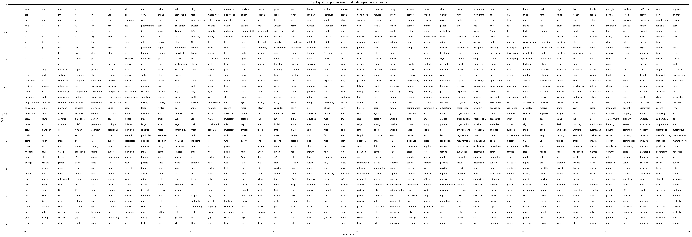

# SOM-word-vectors

This project aims at representing some of the most common English words on a 2D topological map. It is done by using a self-organizing map (SOM), also known as a Kohonen neural network. These networks apply competitive learning to preserve the topology of the data points in higher dimensional feature space to lower-dimensional ones. This is useful for visualising high dimensional data.

### Experiments

In the experiments of this project, pre-trained word vectors were used as input vectors and a 2D uniform grid of varying size were used as output space. Lists of the most common words in different domains were found on the internet and are described further below for each experiment. Find out more about how the data files were formatted in the [data directory](data/README.md). 

#### The English language

In the first experiment, pre-trained 300-dimensional glove word vectors (glove.6B.300d.txt) made available by [Stanford University](https://nlp.stanford.edu/projects/glove/) were used. The output space consisted of a 40x40 uniform grid. To determine the 2000 most commonly used words in the English language, the list _google-10000-english-no-swears.txt_ from [this repository](https://github.com/first20hours/google-10000-english) 
was used. The words in this list were determined by [n-gram](https://en.wikipedia.org/wiki/N-gram) [frequency analysis](https://en.wikipedia.org/wiki/Frequency_analysis) of the [Google's Trillion Word Corpus](https://books.google.com/ngrams/info).
These 2000 words were the words included in the input space during training and plotting.
The units/vertices in the grid were labelled to the label that the closest data point has (Euclidean distance). 

Training Parameters used:

|Parameter|value|
|-----|----|
|Words|2000|
|Epochs|500|
|Learning rate| 0.2|
|Unit initialisation|Gaussian(0,1)|
|Grid size|40x40|
|Initial neighborhood range| 40 (Manhattan distance)|

The resulting plot can be seen here:

Click [here](results/Glove.6B.300d40_u2d.png?raw=true "Topological map of words in the English language") to open the picture in new tab. 

As seen on the results, similar words are positioned close to each other. 